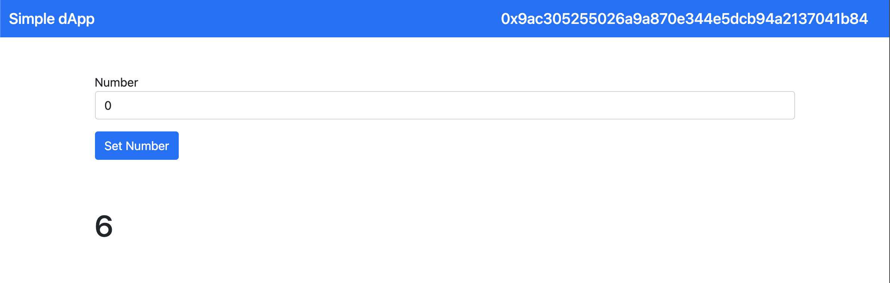

# Simple dApp Tutorial Project

## A simple dApp tutorial project to teach how to deploy a dApp on Ethereum's blockchain and interact with it
  ---
### You can find the article here:
<ul>
  <li><strong>pt1:</strong> https://www.linkedin.com/pulse/pt1-easily-create-decentralized-application-dapp-react-bernardo/</li>
</ul>
  ---

